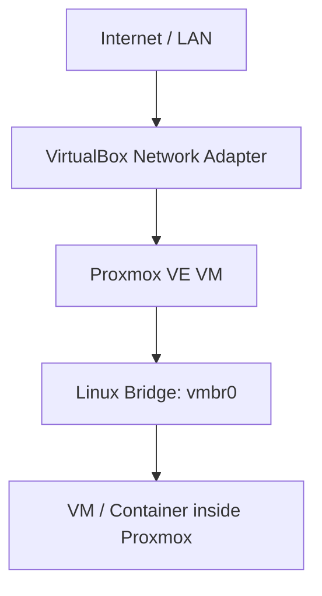
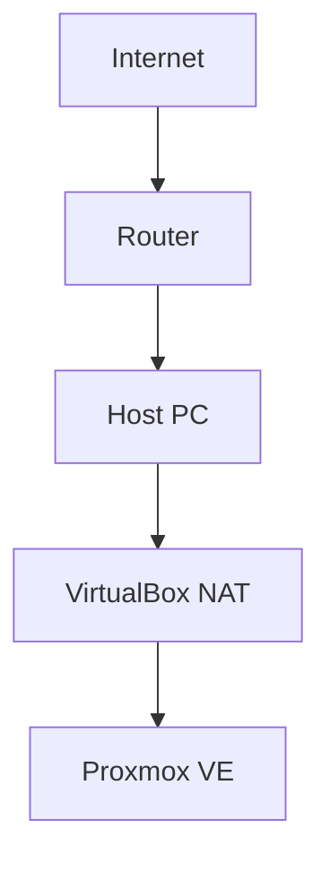
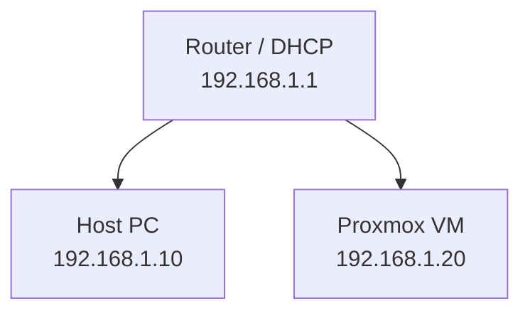
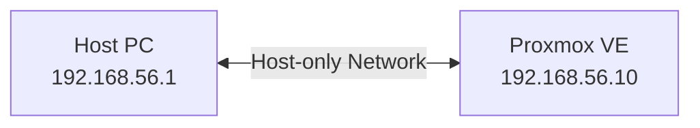
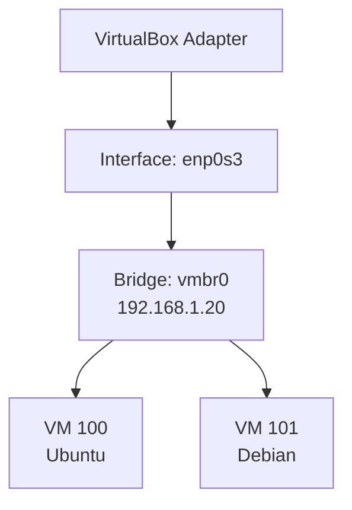

This guide covers networking when **Proxmox VE (PVE) is installed as a virtual machine inside VirtualBox**. A misconfiguration at the first layer (VirtualBox) can knock out network connectivity for every VM running inside Proxmox as well.

The key idea is to distinguish two network layers: **VirtualBox → Proxmox VE** and **Proxmox VE → VMs/containers inside PVE**.



---

## 1. VirtualBox's Three Network Modes

VirtualBox offers several networking modes. The three most relevant for a Proxmox lab are:

| Mode | Internet | Access from Host | Access from LAN | DHCP |
| :--- | :---: | :---: | :---: | :--- |
| **NAT** | ✅ | Limited | ❌ | VirtualBox |
| **Bridged Adapter** | ✅ | ✅ | ✅ | Router/LAN |
| **Host-only Adapter** | ❌* | ✅ | ❌ | VirtualBox (optional) |

> **Note:** *Host-only by itself provides no Internet access. Internet can be added via a second adapter, for example combining it with NAT.*

---

## 2. Getting to Know Each Mode

### A. NAT (Network Address Translation)
NAT places the VM behind VirtualBox's own virtual network. VirtualBox acts as the NAT device.



- **Typical IP allocation:** `10.0.2.0/24`
- **VM IP (Proxmox):** `10.0.2.15`
- **Gateway:** `10.0.2.2` | **DNS:** `10.0.2.3`

**Pros & cons:**
- ✅ Very simple setup — the VM gets Internet access immediately.
- ✅ No changes needed to the physical network (safe for installation and updates).
- ❌ The host can't directly reach services on the VM (like the Proxmox Web GUI) without *port forwarding*. The VM also doesn't appear on the physical LAN.

### B. Bridged Adapter
A Bridged Adapter makes the virtual network adapter look like an independent device on the physical network (LAN). VirtualBox forwards traffic directly through the host's physical adapter.



- **DHCP:** Proxmox can get an IP directly from the physical router.
- **Gateway:** `192.168.1.1` (the physical router's IP)

**Pros & cons:**
- ✅ Proxmox is directly reachable from the host and other devices on the LAN.
- ✅ Great for simulating a real server on the local network.
- ❌ Depends on the physical LAN. Some Wi-Fi networks have security restrictions (MAC filtering/isolation) that block bridging.

### C. Host-only Adapter
Host-only creates a private network between the Host and the VM with no direct Internet connection.



- **Typical IP allocation:** `192.168.56.0/24` (Host IP: `192.168.56.1`, Proxmox IP: `192.168.56.10`)
- The host can `ping 192.168.56.10` directly to reach Proxmox, but Proxmox is isolated from the Internet.

---

## 3. Impact on Proxmox VE (vmbr0)

Inside Proxmox, networking is managed using a **Linux Bridge** (`vmbr0`). Proxmox's physical interface (e.g. `enp0s3`) usually has no IP of its own; the IP is assigned to `vmbr0`, which bridges the network to the VMs inside Proxmox.



### Proxmox Network Configuration (`/etc/network/interfaces`)

**A. Using DHCP (for Bridged / simple labs):**
```ini
auto lo
iface lo inet loopback

auto enp0s3
iface enp0s3 inet manual

auto vmbr0
iface vmbr0 inet dhcp
    bridge-ports enp0s3
    bridge-stp off
    bridge-fd 0
```

**B. Using a Static IP (recommended for consistent access):**
```ini
auto lo
iface lo inet loopback

auto enp0s3
iface enp0s3 inet manual

auto vmbr0
iface vmbr0 inet static
    address 192.168.1.20/24
    gateway 192.168.1.1
    bridge-ports enp0s3
    bridge-stp off
    bridge-fd 0
```

---

## 4. Lab Scenarios & Best Practices

| Scenario | Recommended Adapter | Notes |
| :--- | :--- | :--- |
| **Initial install & PVE updates** | **NAT** | Most stable; PVE gets Internet access right away. Needs *port forwarding* (e.g. Host `127.0.0.1:8006` → VM `10.0.2.15:8006`) to reach the Web GUI. |
| **Isolated lab (host access only)** | **Host-only** | The host can open `https://192.168.56.10:8006` directly, but Proxmox has no Internet access. |
| **Proxmox as a LAN server** | **Bridged** | PVE gets an IP from the LAN (e.g. `192.168.1.20`). Any device on the LAN can reach it. |
| **Private lab + Internet access** | **NAT + Host-only** | Use two VirtualBox adapters: **NAT** for Internet access and **Host-only** for a static management/Web GUI connection from the host PC. Make sure PVE's default gateway points to the NAT interface. |

### Networking for VMs Inside Proxmox
If VirtualBox is set to **Bridged**, VMs created inside Proxmox (e.g. an Ubuntu VM) can use DHCP from the physical router, as if that VM were directly connected to the same LAN as the host.

---

## 5. Troubleshooting Layer by Layer

If Proxmox's connection has issues, check from the bottom up in this order:

1. **Check interface status:** `ip -br link` (make sure the state is `UP`)
2. **Check the IP address:** `ip -br addr` (make sure `vmbr0` has the correct IP)
3. **Check routing:** `ip route` (make sure there's a `default via <gateway_IP>`)
4. **Test the gateway:** `ping -c 4 <gateway_IP>` (local connection to the router/VirtualBox gateway)
5. **Test Internet:** `ping -c 4 1.1.1.1` (check whether NAT/ISP routing works)
6. **Test DNS:** `ping -c 4 google.com` (check name resolution configuration)

**Quick diagnosis:**
- *Gateway fails:* interface / bridge / VirtualBox network configuration issue.
- *1.1.1.1 fails but the gateway responds:* routing / NAT issue.
- *IP works but domain fails:* DNS issue (`/etc/resolv.conf`).

> **Tip:** Always keep `hostname`, `/etc/hostname`, and `/etc/hosts` consistent to avoid internal hostname resolution issues on Proxmox.