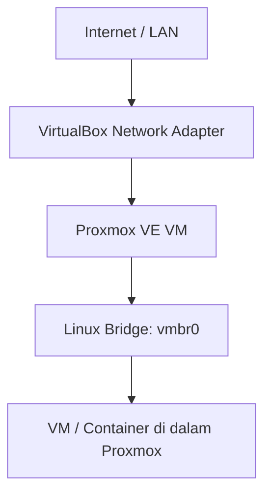
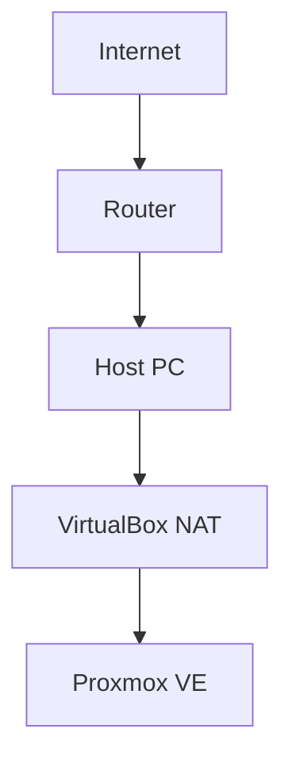
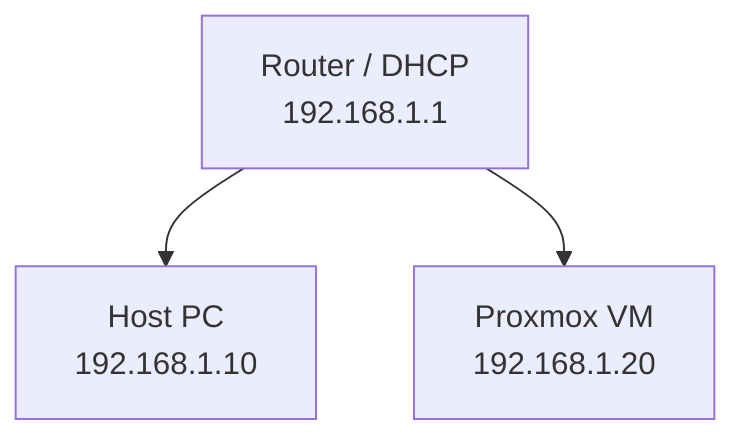
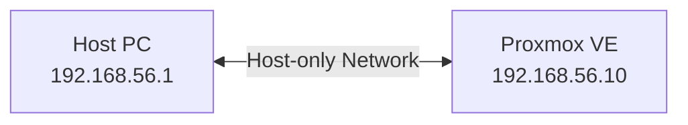
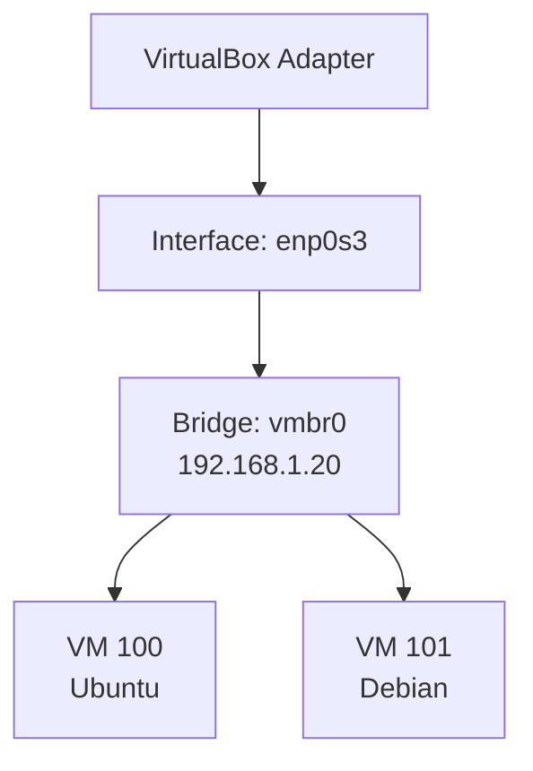

Panduan ini membahas networking ketika **Proxmox VE (PVE) di-install sebagai virtual machine di VirtualBox**. Kesalahan konfigurasi pada layer pertama (VirtualBox) dapat membuat seluruh VM di dalam Proxmox ikut kehilangan koneksi.

Konsep utamanya adalah membedakan dua lapisan jaringan: **VirtualBox → Proxmox VE** dan **Proxmox VE → VM/Container di dalam PVE**.



---

## 1. Tiga Mode Network VirtualBox

VirtualBox menyediakan beberapa mode networking. Tiga mode yang paling relevan untuk lab Proxmox adalah:

| Mode | Internet | Akses dari Host | Akses dari LAN | DHCP |
| :--- | :---: | :---: | :---: | :--- |
| **NAT** | ✅ | Terbatas | ❌ | VirtualBox |
| **Bridged Adapter** | ✅ | ✅ | ✅ | Router/LAN |
| **Host-only Adapter** | ❌* | ✅ | ❌ | VirtualBox opsional |

> **Catatan:** *Host-only sendiri tidak menyediakan akses Internet. Internet dapat ditambahkan dengan adapter kedua, misalnya menggabungkannya dengan NAT.*

---

## 2. Mengenal Masing-Masing Mode

### A. NAT (Network Address Translation)
NAT membuat VM berada di belakang jaringan virtual VirtualBox. VirtualBox bertindak sebagai perangkat NAT.



- **Alokasi IP Biasa:** `10.0.2.0/24`
- **IP VM (Proxmox):** `10.0.2.15`
- **Gateway:** `10.0.2.2` | **DNS:** `10.0.2.3`

**Kelebihan & Kekurangan:**
- ✅ Setup sangat sederhana, VM langsung bisa akses Internet.
- ✅ Tidak perlu mengubah jaringan fisik (aman untuk instalasi dan update).
- ❌ Host tidak dapat langsung mengakses service di VM (seperti Web GUI Proxmox) tanpa *Port Forwarding*. VM juga tidak muncul di jaringan LAN fisik.

### B. Bridged Adapter
Bridged Adapter membuat network adapter virtual terlihat seperti perangkat independen di jaringan fisik (LAN). VirtualBox meneruskan traffic langsung melalui adapter fisik host.



- **DHCP:** Proxmox bisa mendapat IP langsung dari Router fisik.
- **Gateway:** `192.168.1.1` (IP Router fisik)

**Kelebihan & Kekurangan:**
- ✅ Proxmox dapat diakses langsung dari host dan perangkat lain di LAN.
- ✅ Sangat cocok untuk mensimulasikan server sesungguhnya di jaringan lokal.
- ❌ Bergantung pada LAN fisik. Beberapa jaringan Wi-Fi memiliki batasan keamanan (MAC filtering/isolation) terhadap bridge.

### C. Host-only Adapter
Host-only membuat jaringan privat antara Host dan VM tanpa koneksi langsung ke Internet.



- **Alokasi IP Biasa:** `192.168.56.0/24` (IP Host: `192.168.56.1`, IP Proxmox: `192.168.56.10`)
- Host bisa langsung `ping 192.168.56.10` untuk mengakses Proxmox, namun Proxmox terisolasi dari Internet.

---

## 3. Dampaknya pada Proxmox VE (vmbr0)

Di dalam Proxmox, jaringan dikelola menggunakan **Linux Bridge** (`vmbr0`). Interface fisik Proxmox (contoh: `enp0s3`) biasanya tidak memiliki IP; IP diberikan ke `vmbr0` yang menjembatani jaringan ke VM di dalam Proxmox.



### Konfigurasi Jaringan Proxmox (`/etc/network/interfaces`)

**A. Menggunakan DHCP (Untuk Bridged / Lab Sederhana):**
```ini
auto lo
iface lo inet loopback

auto enp0s3
iface enp0s3 inet manual

auto vmbr0
iface vmbr0 inet dhcp
    bridge-ports enp0s3
    bridge-stp off
    bridge-fd 0
```

**B. Menggunakan Static IP (Direkomendasikan agar akses konsisten):**
```ini
auto lo
iface lo inet loopback

auto enp0s3
iface enp0s3 inet manual

auto vmbr0
iface vmbr0 inet static
    address 192.168.1.20/24
    gateway 192.168.1.1
    bridge-ports enp0s3
    bridge-stp off
    bridge-fd 0
```

---

## 4. Skenario Lab & Best Practices

| Skenario | Rekomendasi Adapter | Catatan |
| :--- | :--- | :--- |
| **Instalasi Awal & Update PVE** | **NAT** | Paling stabil, PVE langsung bisa akses Internet. Butuh *Port Forwarding* (misal Host `127.0.0.1:8006` → VM `10.0.2.15:8006`) untuk akses Web GUI. |
| **Lab Terisolasi (Akses dari Host)** | **Host-only** | Host bisa langsung buka `https://192.168.56.10:8006`, tapi Proxmox tidak ada Internet. |
| **Proxmox sebagai Server LAN** | **Bridged** | PVE mendapat IP dari LAN (misal `192.168.1.20`). Perangkat apa pun di LAN bisa mengaksesnya. |
| **Lab Privat + Akses Internet** | **NAT + Host-only** | Gunakan 2 adapter VirtualBox. **NAT** untuk akses Internet, dan **Host-only** untuk akses management/Web GUI yang statis dari Host PC. Pastikan default gateway PVE diarahkan ke interface NAT. |

### Jaringan untuk VM di Dalam Proxmox
Jika VirtualBox diatur ke **Bridged**, maka VM yang dibuat di dalam Proxmox (misal VM Ubuntu) dapat menggunakan DHCP dari Router fisik, seolah-olah VM tersebut langsung terhubung ke jaringan LAN yang sama dengan Host.

---

## 5. Troubleshooting Layer demi Layer

Jika koneksi Proxmox bermasalah, periksa dari bawah ke atas menggunakan urutan ini:

1. **Cek Status Interface:** `ip -br link` (Pastikan state `UP`)
2. **Cek Alamat IP:** `ip -br addr` (Pastikan `vmbr0` memiliki IP yang benar)
3. **Cek Routing:** `ip route` (Pastikan ada `default via <IP_Gateway>`)
4. **Tes Gateway:** `ping -c 4 <IP_Gateway>` (Koneksi lokal ke router/VirtualBox gateway)
5. **Tes Internet:** `ping -c 4 1.1.1.1` (Cek apakah NAT/routing ISP jalan)
6. **Tes DNS:** `ping -c 4 google.com` (Cek konfigurasi name resolution)

**Diagnosa Cepat:**
- *Gateway gagal:* Masalah interface / bridge / konfigurasi network VirtualBox.
- *1.1.1.1 gagal tapi gateway tembus:* Masalah routing / NAT.
- *IP tembus tapi Domain gagal:* Masalah DNS (`/etc/resolv.conf`).

> **Tip:** Selalu pertahankan konsistensi `hostname`, `/etc/hostname`, dan `/etc/hosts` agar tidak terjadi masalah resolusi hostname secara internal di Proxmox.
